# Курсовой проект

## Тема проекта
Распараллеливание задачи обработки изображений
## Описание проекта
Фильтрация изображений на GPU.
Написать программу, в которой можно ввести значения для матрицы свертки и применить ее к изображению. 
Сравнить скорость обработки на CPU и GPU.

## Реализация
Написана программа на c++ для обработки изображений с использованием cuda. Формат изображения - PPM (простой для чтения и понимания, 
[описание формата](http://netpbm.sourceforge.net/doc/ppm.html), открыть можно с помощью [IrfanView](https://www.irfanview.com/)),
глубина цвета - 8 бит (всего 256 цветов), RGB (без альфа-канала).
Позволяет применять матрицы 5 * 5 и меньше (если заполнить только центральную матрицу 3 * 3, то код будет выполняться как для матрицы 3 * 3) с делителем и смещением.
Собрана в dll.

Написан графический интерфейс на WPF. Поддерживает ввод данных, вывод исходного и обработанного изображения. 

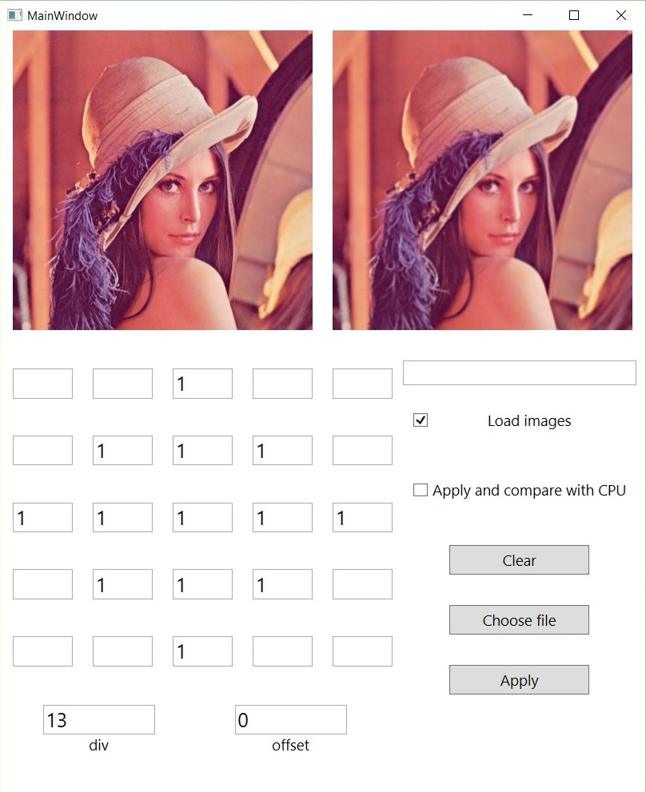

### Оригинальное изображение

Знакомьтесь, [Лена](https://techtoday.in.ua/ru/news-ru/kak-segodnya-vyiglyadit-lena-forsen-zhenshhina-kotoraya-stala-pervoy-fotografiey-jpg-110004.html)


и в grayscale для эффектов тиснения.


### Негатив

Матрица имеет вид (только offset задать 255)
```
0  0 0
0 -1 0
0  0 0

div = 1, offset = 255
```

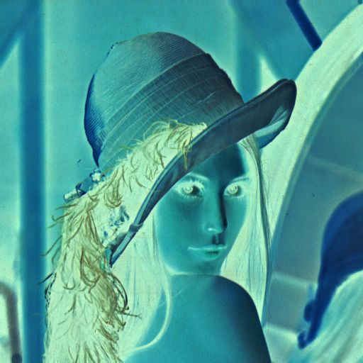

### Низкочастотные фильтры

Используются для уменьшения шумов, сглаживания изображения.

```
1 1 1
1 1 1
1 1 1

div = 9, offset = 0
```

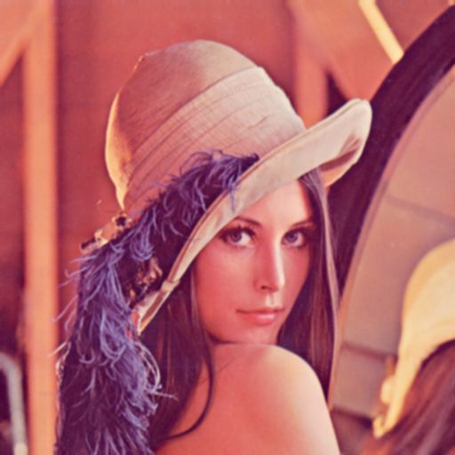

```
1 1 1
1 2 1
1 1 1

div = 10, offset = 0
```


Размытие Гаусса

```
1 2 1
2 4 2
1 2 1

div = 16, offset = 0
```

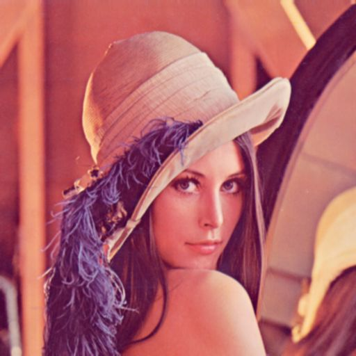

Light-blur

```
1 1 0
1 1 0
0 0 0

div = 4, offset = 0
```


### Высокочастотные фильтры

Добавляет шумы, усиливает контраст.

```
-1 -1 -1
-1  9 -1
-1 -1 -1

div = 1, offset = 0
```

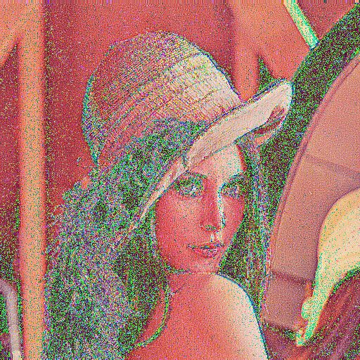

```
 0 -1  0
-1  5 -1
 0 -1  0

div = 1, offset = 0
```

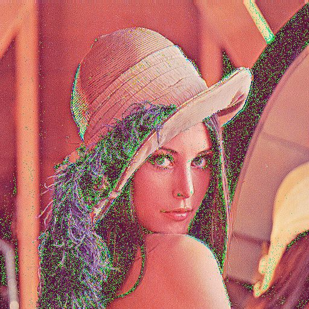

```
 0 -2  0
-2  5 -2
 0 -2  0

div = 1, offset = 0
```

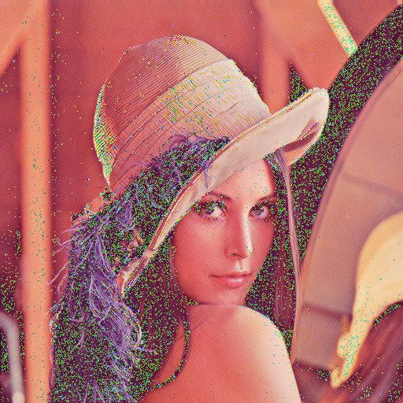

Light-sharpen

```
-1 0 0
 0 2 0
 0 0 0

div = 1, offset = 0
```

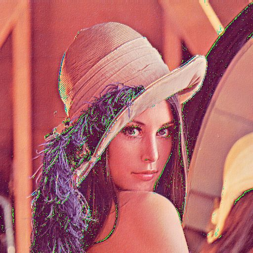

### Оператор Лапласа

Усиливает края выделяя контур изображения.

```
0  1 0
1 -4 1
0  1 0

div = 1, offset = 0
```

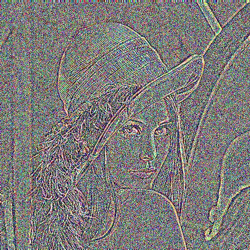

```
0  1 0
1 -8 1
0  1 0

div = 4, offset = 0
```

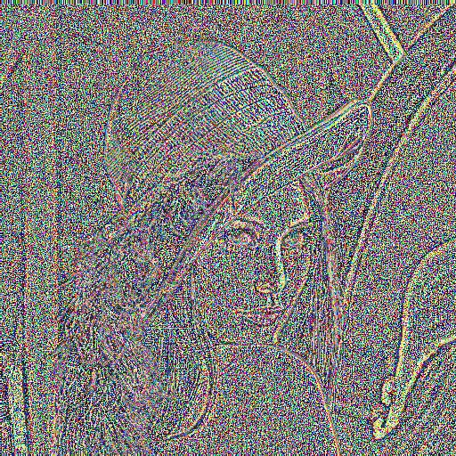

```
 1 -2  1
-2  4 -2
 1 -2  1

div = 1, offset = 0
```

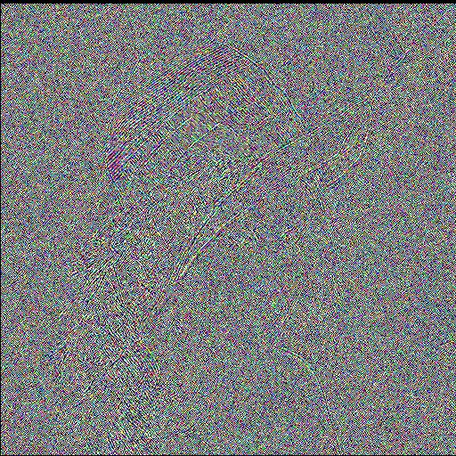

(погорячился с фразой про выделение контура)

### Эффект тиснения

Делает изображение похожим на гравюру (отлично смотриться с grayscale)

```
0  1  0
1  0 -1
0 -1  0

div = 1, offset = 0
```

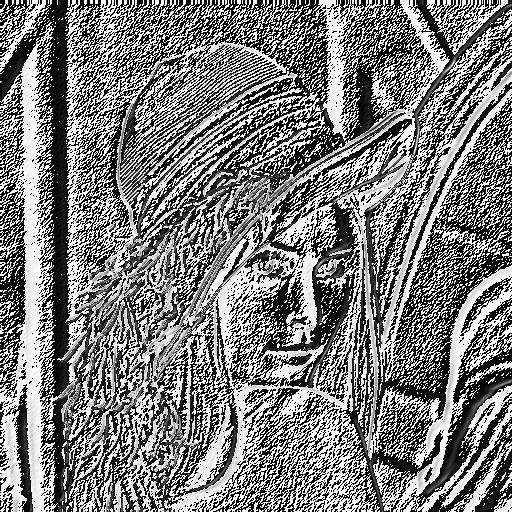

```
-2 -1 0
-1  1 1
 0  1 2

div = 1, offset = 0
```

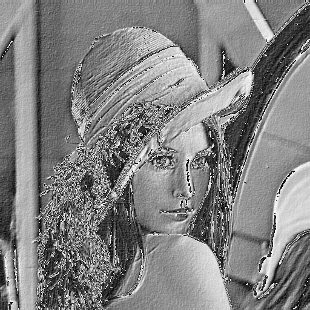

Light-emboss

```
1 0  0
0 1  0
0 0 -1

div = 1, offset = 0
```

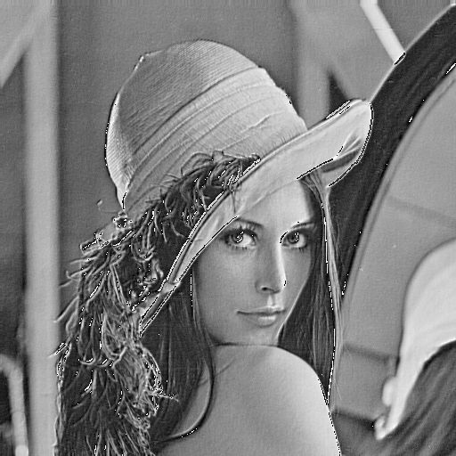

### Расчет конфигурации

Использовался [CUDA Occupancy Calculator](https://docs.nvidia.com/cuda/cuda-occupancy-calculator/index.html).
Параметры приведены ниже:

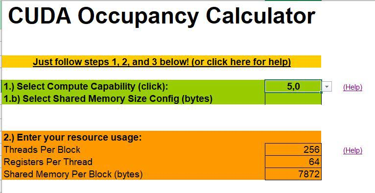

И результат:

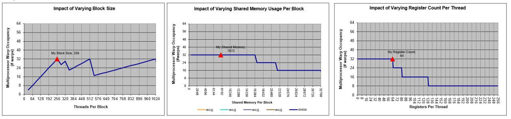

Размеры (указаны как двумерные величины, т.е. z = 1): 
* block: 32 * 8 threads;
* grid: (width + 127)/128 * (height + 7)/8;

32 было выбрано в соответствии с размером warp. 
Обрабатываемое число пикселей 128 - оптимальное число для обработки небольших по ширине изображений.
Первый пик на графике block size - 256, если выбрать второй пик, то просядем по памяти. Максимальное количество регистров при кото 64.

Occupancy в рассчитанном случае составляет 50%.

### Оптимизация

#### Чтение и запись с глобальной памяти

За каждое обращение можно читать по 4 байта. При чтении используется int (4 байта). 
При записи записываем блоки по 4 * 3 байта (ниже будет почему выбран такой формат).

#### Выравнивание строк изображения

При чтении изображения по 4 байта каждая строка должна быть выровнена на границу 4 байта.
Используется функция cudaMallocPitch, которая выделяет память с выравниванием и возвращает в pitch фактическую длину строки.
При копировании и работе с массивами в дальнейшем также используется pitch.

#### Представление цветных изображений

* RGB - каждый пиксель 3 байта, пиксели друг за другом:
  * \+ плотное размещение;
  * \+ не требует дополнительных преобразований;
  * \- требует специальную схему для обработки.
* RGBA - каждый пиксель 4 байта, 3 байта цвета + альфа канал.
  * \+ один пиксель - один int, просто читать и обрабатывать;
  * \- альфа канал редко используется, данные более разрежены;
  * \- в большинстве случаев требует дополнительного преобразования данных.
* Планарный RGB - каждый цвет лежит в отдельной плоскости:
  * \+ простая схема обработки как для серых изображений;
  * \+ возможность обработки каналов отдельно;
  * \+ плотное размещение данных;
  * \- требуется предварительная стадия для разбиения на плоскости.
  
##### Особенность обработки для RGB

12 байт - это 4 пикселя и одновременно 3 int. 
При этом доступно чтение по 4 байтам.
Поэтому обрабатываем и записываем в глобальную память блоками по 12 байт.

#### Используемая память

Для ускорения обработки данные, над которыми производяться вычисления копируются в разделяемую память, а фильтр, который применяем - в константной памяти.
 
#### Банки памяти

Чтобы избежать конфликтов доступа разных нитей варпа к одному банку памяти считываем значения через 32 байта, что равно числу банок.
 
### TODO

- ~~Расширить матрицу до 5 * 5.~~ 
- Применить функции min, max, minmax, медианное, гармоническое. (Можно, я собираюсь сделать это через указатель на функцию, но это сильно замедляет работу (в 3 раза), поэтому не буду).


### Ссылки

[Сравненние производительности ГПУ на разных задачах](https://parallel.ru/gpu/performance.html)

[тык](https://habr.com/ru/post/142818/)

[тык](https://habr.com/en/post/43895/)

[тык](https://docs.gimp.org/2.4/ru/plug-in-convmatrix.html)

[тык](https://studfile.net/preview/1557426/)

[тык](https://en.wikipedia.org/wiki/Kernel_(image_processing))

[тык](matlabtricks.com/post-5/3x3-convolution-kernels-with-online-demo)

[тык](http://web.pdx.edu/~jduh/courses/Archive/geog481w07/Students/Ludwig_ImageConvolution.pdf)

[тык](https://www.nvidia.ru/object/cuda_state_university_courses_new_ru.html)

[тык](https://desktop.arcgis.com/ru/arcmap/10.3/manage-data/raster-and-images/convolution-function.htm)

[тык]()


